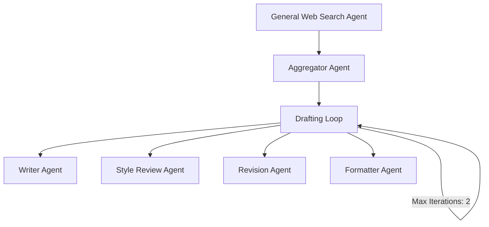

# Article Writing Agent ADK

## Overview
This project is an advanced article writing agent built using the Google ADK framework. It leverages multiple agents to perform tasks such as research, drafting, style review, revision, and formatting. The agents work collaboratively to produce high-quality, well-structured articles tailored to the user's style and requirements.

## Features
- **General Web Search Agent**: Performs research on the given topic and synthesizes findings.
- **Aggregator Agent**: Aggregates research findings into a coherent brief.
- **Drafting Loop**: Iteratively drafts, reviews, and revises the article using the Writer Agent, Style Review Agent, and Revision Agent.
- **Formatter Agent**: Formats the final article into clean, readable markdown.

## Agent Workflow


## Steps to Run

1. **Install Google ADK**
   ```bash
   pip install google-adk
   ```

2. **Create an Agent**
   ```bash
   adk create <folder_name>
   ```

3. **Update the `.env` File**
   Include your API key in the `.env` file to authenticate with the Google ADK services.

4. **Provide Writing Style Sample**
   Add a sample of your writing style in the `writing_style.md` file. This will be used by the Style Review Agent to match the tone and style.

5. **Refine Prompts**
   If needed, refine the prompts in the `agent.py` file to better suit your requirements.

6. **Run the Agent**
   Start the agent on localhost:
   ```bash
   adk run web
   ```

## Notes
- Ensure all dependencies are installed as per the `requirements.txt` file.
- The `writing_style.md` file should contain sufficient content to help the Style Review Agent analyze your writing style.